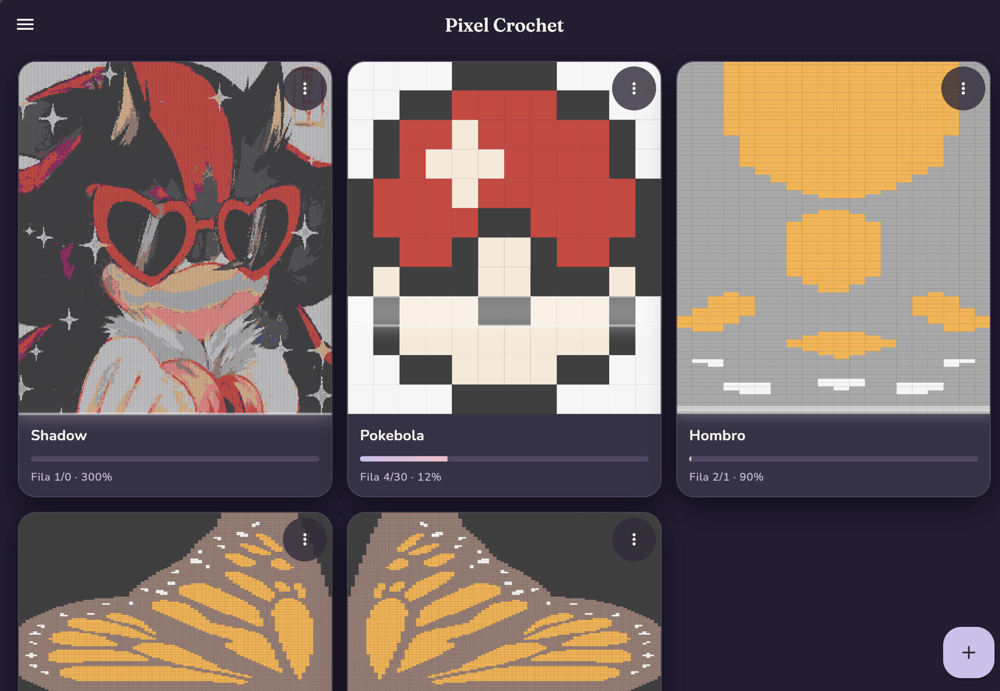
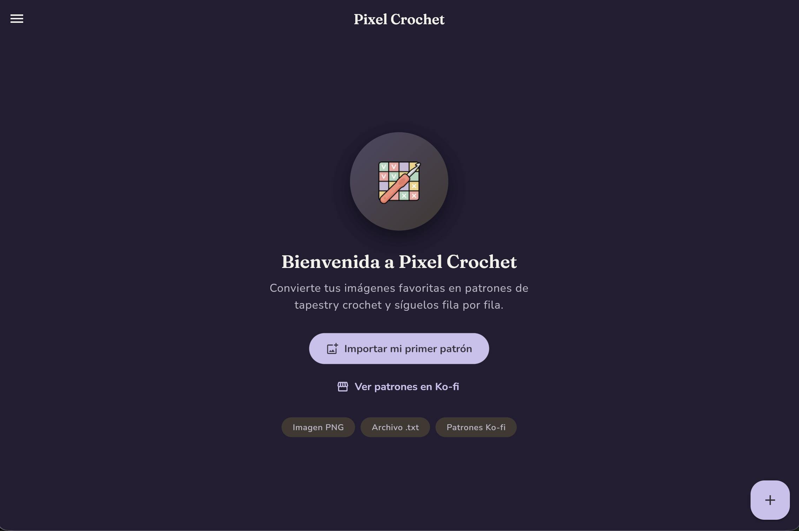
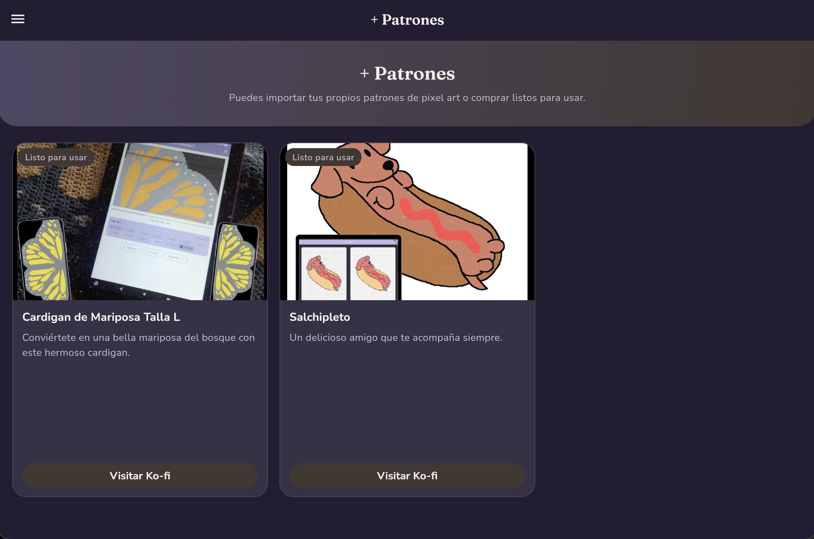
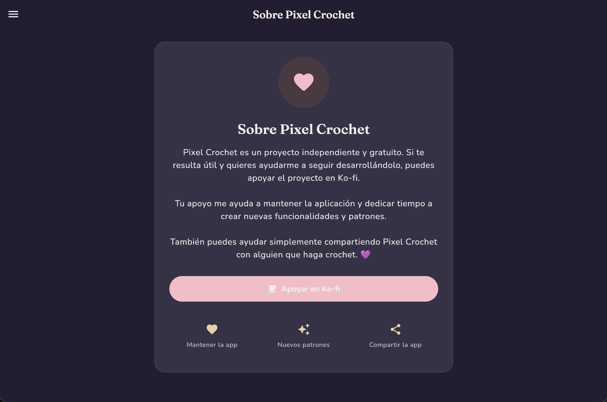
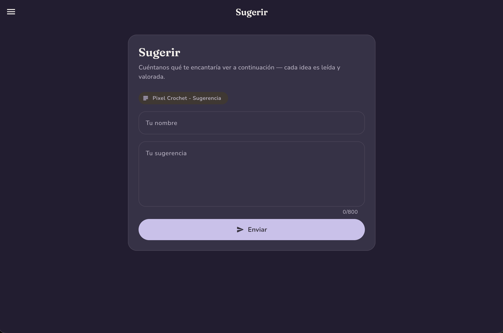

# Pixel Crochet

**English** · [Español](README.es.md)

<p align="center">
  
</p>

<p align="center">
  <b>Made stitch by stitch.</b><br>
  Nobody picks up a crochet hook to do math. Pixel Crochet does the counting for you.
</p>

Pixel Crochet is a free, open-source app for **tapestry crochet** that takes the hardest part — keeping count — and turns it into something you barely notice. Paste a Stitch Fiddle–style pattern, or import a picture of pixel art or cross-stitch, and the app builds an interactive guide. Follow it row by row, tap the blocks you finish, and your progress saves itself.

**Try it live:** [pixel-crochet.vercel.app](https://pixel-crochet.vercel.app/)

## Screenshots

<p align="center">
  
</p>

| Home | More Patterns | About | Suggest |
|:---:|:---:|:---:|:---:|
|  |  |  |  |

## Why this exists

Tapestry crochet is perfect until row 47 of 213. Then you lose your place, squint at the tiny numbers, count for the fourth time, and quietly accept that the row has to be undone.

Pixel Crochet is that problem, removed. It shows you only what you need while you're stitching: the current row, the direction to read it, and the color blocks for that moment. You mark, you advance, you relax.

## Features

**Import a picture, wear the pattern later.** Drop a PNG or JPG of pixel art or cross-stitch and the app turns it into a pattern: it detects the color palette, suggests stitch dimensions, and lets you swap any color for the yarn actually in your stash.

**Paste or upload Stitch Fiddle patterns.** Text patterns in the standard `Row N: 10 red, 5 white` format are parsed for you — paste the text or pick a `.txt` file.

**A guide, not a wall of numbers.** The current row is split into color blocks, with an arrow that respects the reading direction (left-to-right or right-to-left) — that detail that ends more projects than it should.

**Progress with a tap.** Finish a block, tap it, done — it's crossed out. Realized you miscounted? Step back a row, or jump anywhere in the pattern.

**Saved on autopilot.** Close the app at midnight; next evening it opens exactly where you left off. No exporting, no printing, no remembering.

**Made for the couch.** The whole interface is designed to hold in one hand while the other is mid-project. No menus buried three levels deep.

## How it works

1. **Import** — paste a pattern's text, select a `.txt` file, or pick a PNG/JPG image.
2. **Tune it** — name the project, set the stitch dimensions, and remap colors to the yarn you own. Everything previews before you commit.
3. **Stitch** — follow the row, mark blocks as you go, and let the app keep the count.

## Example patterns

Ready to test in `example/`:

- `mariposa_amarilla.txt` — a butterfly at 82 × 213, a proper big project
- `blue_guy.txt` — a 32 × 32 tile

## Support the project

Pixel Crochet is free and made with love by one person. If it keeps you from counting, there are a few honest ways to say thanks:

- [Pattern shop](https://ko-fi.com/pixel_crochet/shop) — ready-made pixel patterns, including *Salchipleto*, the dachshund who is always by your side.
- [Ko-fi](https://ko-fi.com/pixel_crochet) — keep the app alive.
- [Suggestions](mailto:mypixelcrochet@gmail.com) — tell us what you'd love to see next.
- Or simply share it with someone who crochets. That genuinely helps.

## Development

**Requirements:** Flutter with the Dart SDK `^3.8.1`.

```bash
flutter pub get
flutter run                 # Android / iOS / desktop
flutter run -d chrome       # web
flutter test
flutter analyze
```

**Stack:** Flutter · Riverpod (state) · Go Router (navigation) · `intl` + `flutter_localizations` (i18n in English and Spanish) · `google_fonts` · `shared_preferences` (persistence) · `file_picker` + `image` (image → pattern).

Quick map of `lib/`:

```
lib/
  core/        models, theme, constants, storage, i18n keys
  features/    home, project, import (text), import_image, more_patterns, support, suggest
  shared/      widgets and utilities reused across features
  generated/   generated localizations
```

## License

[MIT](LICENSE) © 2026 Camilú

Made stitch by stitch.